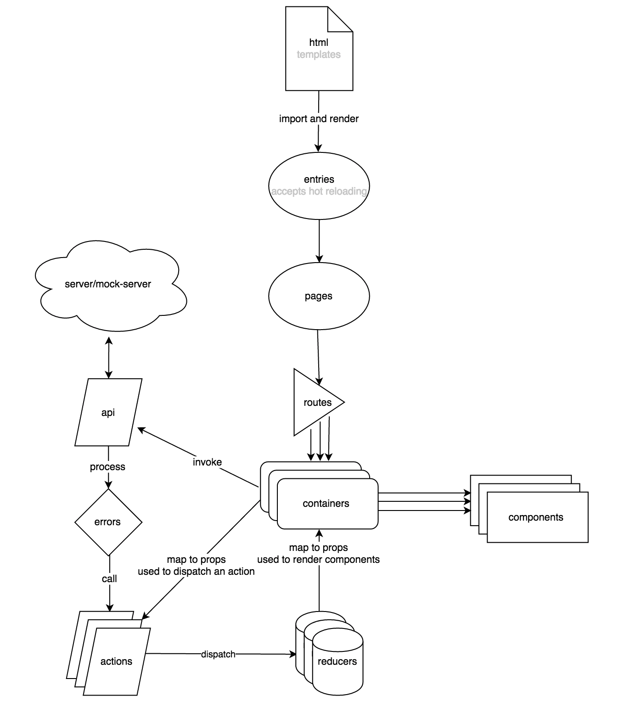

# react-scaffold

## FEATURE

- react
- react router
- react hot reloading
- page transition
- multiple entries
- redux
- react redux
- redux logger
- redux thunk
- webpack packaging
- material ui
- mock server
- unified error center
- internationalization
- environments
- webpack visualizer

## STRUCTURE

As we find out html are mostly same in react projects, we extract the same html into a template file which lays in `html` folder.

`html-webpack-plugin` is used to generate released html files, which load corresponding js files.

`entries` stores js main methods, we split main container to `containers` because entry could not be hot-module-replaced.

`entries`s import `containers`s, which is one to one correspondent. `render` method in entry provides all commonly used setups, such as redux store, provider, injectTapEventPlugin for material-ui, and custom styles.

`containers` is the headquarters which imports all dummy components, passing through props to them. Also, `containers` interacts with redux `reducers` and `actions`.

It is recommended that you wrap containers into another. `redux` will re-render a container when and only when mapped reducers have been updated.

We do not use async redux for ajax requests because ajax status is not that important for us to record. So, we invoke `api` in `containers`, get response, and determine what `actions` to call.

We store every string in `i18n` for better internationalization.

Built project files will be in the `release` folder. With `build.log`, you can see every build details. With `stats.html`, you can optimize your dependencies to make project smaller.

## INITIALIZE

- install nodejs
- install [gt](https://github.com/vivaxy/granturismo)

    `sudo npm install -g granturismo`
    
- add scaffold into gt `gt config add vivaxy/react-scaffold https://github.com/vivaxy/react-scaffold.git`
- create your project directory `mkdir my-project-name && cd my-project-name` or `git clone ...`
- run `gt init`
- select `vivaxy/react-scaffold`

## DEVELOP

- `npm start`
- open in browser `http://0.0.0.0:${port}/html/index.html`

## BUILD

- `npm run build`

## CONTRIBUTE

Feel free to submit any issue.

## TODO

- eslint for code styles

## REFERENCE

- https://github.com/webpack/docs/wiki/webpack-dev-server
- https://github.com/gaearon/react-hot-loader/tree/master/docs
- https://github.com/reactjs/react-router-redux
- https://github.com/ampedandwired/html-webpack-plugin
- https://github.com/ReactTraining/react-router
